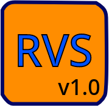

# RevanScript-RVS-Project
 RevanScript-Interpreter

RevanScript (RVS) Direct Execution Interpreter Model

  

+---------------------------------------+
|--< RevanScript (RVS) Documentation >--| 
+---------------------------------------+

RevanScript sadə command-based təməli bir proqramlaşdirma dili kimi dizayn etmişən.
Olduqca sadə və minimal sintaksisə malikdir. Bu dilin çalışmasi üçün tərçüməçi proqram təminatını paylaşmışam. 
C proqramlaşdırma dili ilə yazmışam.
Daha ətraflı və praktik nümunələr görmək üçün "https://youtube.com/@RvCodes9" YouTube kanalına baxa bilərsiniz. 

+--------------------------------------+
|-< RevanScript (RVS) Project Layers >-|
+--------------------------------------+

RevanScript (RVS) Memory Management

:: src/rvsmem.c 
:: include/rvsmem.h

RevanScript (RVS) Buffer Memory Management

:: src/rvsbuf.c
:: include/rvsbuf.h

RevanScript (RVS) I/O Input Output Handling

:: src/rvsio.c
:: include/rvsio.h
 
RevanScript (RVS) Interpreter flags

:: src/rvsflg.c
:: include/rvsflg.h
